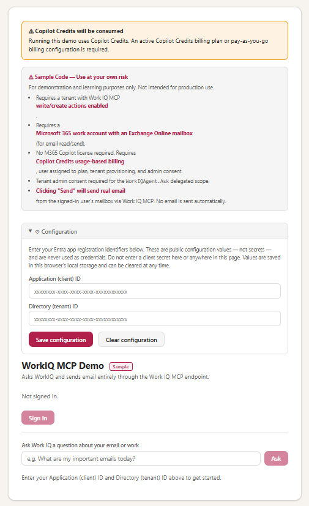

# WorkIQ MCP Demo

This repository is a browser-based reference implementation for connecting directly to the Work IQ remote MCP endpoint. It demonstrates delegated Microsoft Entra authentication, natural-language queries over Microsoft 365 data, and user-approved email sending without requiring a backend service or application framework.

> [!CAUTION]
> ### 💳 Copilot Credits required
> **This demo consumes Copilot Credits when it runs.** The signed-in user must be covered by a billing policy that allows Copilot Credits consumption. The policy can use available Copilot Credits, pay-as-you-go billing, or both.

## Demo preview

<p align="center">
  
</p>

---

## About this repository

The sample is intended for developers and administrators who want to understand the minimum configuration and browser-side flow required to call Work IQ MCP. It uses MSAL.js for sign-in, the MCP Streamable HTTP transport for tool discovery and invocation, and the Work IQ `ask` and `do_action` tools for reading Microsoft 365 context and sending email.

The repository contains:

| File | Description |
|---|---|
| `index.html` | Complete standalone demo application, including the UI, MSAL authentication, MCP client logic, configuration panel, and raw response viewer. |
| `README.md` | Setup requirements for billing, licensing, tenant provisioning, app registration, mutation policy, and local hosting. |
| `workiq-mcp-demo.png` | Screenshot of the demo's initial configuration and sign-in interface. |

No build process, package installation, backend, client secret, or source-code configuration is required. Users enter their Entra application and tenant IDs in the page's Configuration panel.

---

## What this does

`index.html` is a single-page demo (no framework, no build step, no backend) that:

1. Signs the user in via Entra ID (MSAL.js popup)
2. Acquires a Work IQ delegated token (never displayed) using scope `fdcc1f02-fc51-4226-8753-f668596af7f7/WorkIQAgent.Ask`
3. Opens a Work IQ MCP session (Streamable HTTP, `MCP-Protocol-Version: 2025-03-26`): `initialize` → `notifications/initialized` → `tools/list`
4. Calls MCP tool `ask` with the user's question; renders the Copilot text answer
5. On explicit user click, calls MCP tool `do_action` with `actionUrl: /me/sendMail` to send email
6. Shows raw MCP JSON (init, tools/list, ask/send responses) in collapsible `<details>` elements

**Single API surface:** [Work IQ MCP endpoint](https://workiq.svc.cloud.microsoft/mcp).

---

## Prerequisites (status as of 2026-08-11)

### 1. Configure Copilot Credits and licenses

This sample requires:

- A **billing policy that permits Copilot Credits consumption** for the signed-in user. The policy can consume available Copilot Credits, use pay-as-you-go billing, or combine both options. An Azure subscription is required only when using pay-as-you-go billing.
- The signed-in user must be included in or assigned to that billing policy. See [Manage AI experiences enabled by usage-based billing](https://learn.microsoft.com/en-us/microsoft-365/copilot/usage-based-billing-manage-copilot-credits).
- A **Microsoft 365 work or school account with an Exchange Online mailbox** because the sample reads and sends email.

A Microsoft 365 Copilot license is **not required** for this sample because it uses the direct [Work IQ API remote MCP endpoint](https://workiq.svc.cloud.microsoft/mcp).

### 2. Enable the Work IQ service principal

A Global Administrator must complete the one-time setup that creates the Work IQ service principal and provisions the Work IQ resource. Follow Microsoft's [Enable Work IQ API in your organization](https://learn.microsoft.com/en-us/microsoft-365/copilot/extensibility/work-iq/enable-work-iq#enable-work-iq-api-in-your-organization) instructions using the Microsoft Entra admin center or Azure CLI.

### 3. Create an Entra app registration

Create a dedicated app registration by following Microsoft's [Register an application with the Microsoft identity platform](https://learn.microsoft.com/en-us/entra/identity-platform/quickstart-register-app) guidance.

Use the following settings:

- **Name:** Choose a descriptive name, such as `WorkIQ MCP Demo`.
- **Supported account types:** Select **Accounts in this organizational directory only** for a single-tenant deployment.
- **Platform:** Configure a **Single-page application (SPA)** under **Authentication**.
- **Redirect URI:** Add `http://localhost:8080`. Add each additional origin where you host the sample as a separate SPA redirect URI.
- **Credentials:** Do not create a client secret or certificate. Browser-based SPA applications use the OAuth 2.0 authorization-code flow with PKCE and cannot securely store credentials.

Then configure the Work IQ permission:

1. Open **API permissions** > **Add a permission** > **APIs my organization uses**.
2. Search for the Work IQ application ID `fdcc1f02-fc51-4226-8753-f668596af7f7`.
3. Select **Delegated permissions** and add `WorkIQAgent.Ask`.
4. Have an administrator select **Grant admin consent** for the tenant. See Microsoft's [Grant tenant-wide admin consent](https://learn.microsoft.com/en-us/entra/identity/enterprise-apps/grant-admin-consent) guidance.

From the app registration's **Overview** page, copy the **Application (client) ID** and **Directory (tenant) ID**. Both values are public application identifiers, not secrets.

### 4. Enable Work IQ MCP write actions

Work IQ MCP mutation operations are disabled by default. A tenant administrator must configure the policy in the [Microsoft 365 admin center](https://admin.microsoft.com):

1. Go to **Agents** > **Tools**.
2. Select **Work IQ MCP** and open the **Policy** tab.
3. Under **Mutations**, enable **Allow write actions**.
4. Enable **Allow create** so the sample can send email through `do_action /me/sendMail`.
5. Save the policy.

Leave partial update, replace, and delete operations disabled unless other applications in the tenant require them. Policy changes can take up to 24 hours to apply. See Microsoft's [Policy governance for Work IQ MCP](https://learn.microsoft.com/en-us/microsoft-365/copilot/extensibility/work-iq/mcp/policy-governance-mcp) documentation for details.

---

## Run locally

### Python requirement

Use a currently supported release of **Python 3**; Python 3.10 or later is recommended. The server uses Python's built-in `http.server` module, so no packages or `pip install` step is required.

Confirm Python is available:

```powershell
python --version
```

Then start the local server:

```powershell
cd C:\CodeSamples\WorkIQSample
python -m http.server 8080
```

On Windows, if Python is installed through the Python launcher, you can use `py -3 -m http.server 8080` instead.

Open `http://localhost:8080` in a browser (`file://` is NOT supported by MSAL).

1. Click **Sign In** — Entra popup appears
2. Type a question like "What are my important emails today?"
3. Click **Ask WorkIQ**
4. Copilot's answer renders; raw JSON is in the collapsible section

---

## Work IQ MCP API (verified)

| Detail | Value |
|---|---|
| MCP endpoint | [Work IQ MCP](https://workiq.svc.cloud.microsoft/mcp) |
| OAuth resource | [Work IQ MCP](https://workiq.svc.cloud.microsoft/mcp) |
| OAuth metadata | [OAuth protected resource metadata](https://workiq.svc.cloud.microsoft/.well-known/oauth-protected-resource/mcp) |
| Scope | `fdcc1f02-fc51-4226-8753-f668596af7f7/WorkIQAgent.Ask` |
| Transport | Streamable HTTP (`MCP-Protocol-Version: 2025-03-26`) |
| CORS | `Access-Control-Allow-Origin: *`, `Access-Control-Allow-Headers: Authorization, Content-Type, Accept, MCP-Protocol-Version` (confirmed 2026-08-11) |
| Auth flow | Delegated (work/school), OAuth 2.0 auth-code + PKCE via MSAL.js |
| Admin consent | `WorkIQAgent.Ask` admin-consented (AllPrincipals) |
| Ask tool | `ask` — `{ question: string, timeZone?: string }` |
| Send tool | `do_action` — `{ actionUrl: "/me/sendMail", jsonBody: { Message: {...}, SaveToSentItems: bool } }` |

---

## Disclaimer

This project is provided as-is as a reference implementation and sample for educational and demonstration purposes only. It is not intended for production use without thorough review, testing, and hardening appropriate to your environment.

By using this code, you accept full responsibility for any modifications, deployments, and outcomes. The authors make no warranties—express or implied—regarding the suitability, reliability, or security of this solution for any particular purpose. Use of related platforms is subject to their respective terms of service and licensing agreements.

> **In short:** Learn from it, build on it, but validate everything before relying on it.